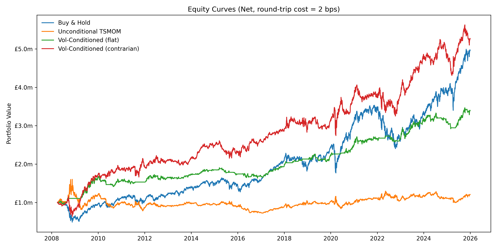
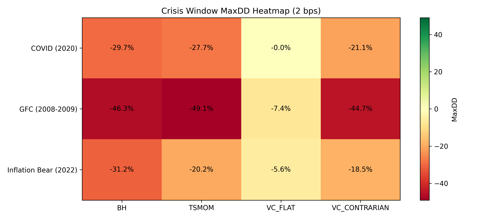

# Volatility-Conditioned Momentum Strategy (Multi-Asset Portfolio)

A systematic, cross-asset momentum strategy enhanced with volatility conditioning, designed to improve robustness, reduce drawdowns, and generate statistically significant returns across multiple market regimes.

---

## Overview

This project implements and evaluates a **volatility-conditioned time-series momentum framework** across a diversified global asset universe.

The core idea:

> Momentum works — but its performance is highly state-dependent. Conditioning on volatility regimes materially improves outcomes.

Economic intuition: Momentum breaks down in high-volatility regimes due to reversals and dislocations. Conditioning on volatility improves performance by reducing exposure during unstable periods and adapting behaviour (trend-following vs contrarian) across regimes.

Based on prior literature on momentum crashes and volatility-managed strategies (Moskowitz et al., 2012; Barroso & Santa-Clara, 2015; Daniel & Moskowitz, 2016; Moreira & Muir, 2017).

The system integrates:
- Cross-asset momentum signals  
- Volatility regime classification  
- Portfolio construction with static asset weights  
- Transaction cost modelling  
- Institutional-grade backtesting and evaluation  

---

## Strategy Variants

Four strategies are evaluated:

- **Buy & Hold (BH)** — passive benchmark  
- **TSMOM** — unconditional time-series momentum  
- **VC_FLAT** — volatility-conditioned momentum where positions are set to 0 during high-volatility regimes  
- **VC_CONTRARIAN** — volatility-conditioned strategy where positions are reversed (opposite of momentum signal) during high-volatility regimes  

---

## Key Results
> **Key Insight:** Volatility conditioning transforms momentum from a fragile anomaly into a robust, drawdown-controlled strategy, with strongest performance during crisis regimes.

### Visual Summary

<p align="center">
  
</p>

<p align="center">
  
</p>

### 1. Equity Curve Behaviour

At low transaction cost levels (0–2 bps), the VC_CONTRARIAN strategy delivers the strongest terminal performance, clearly outperforming all other specifications. VC_FLAT and Buy & Hold track closely over much of the sample, although Buy & Hold ultimately benefits from the strong 2025 rally and finishes ahead. Under a more conservative 10 bps assumption, Buy & Hold becomes the dominant strategy, with VC_CONTRARIAN remaining competitive and VC_FLAT ranking third. In contrast, unconditional TSMOM shows persistently weak performance across all cost assumptions, with no clear evidence of sustained growth.

### 1a. Portfolio Summary (Risk-Adjusted Performance)

Volatility-conditioned strategies dominate on a risk-adjusted basis.

**Sharpe ratios (net | 2 bps):**
- VC_FLAT → 0.77
- VC_CONTRARIAN → 0.58
- Buy & Hold → 0.51
- TSMOM → 0.15

VC_FLAT delivers the highest Sharpe ratio via strong drawdown control and reduced exposure in high-volatility regimes. VC_CONTRARIAN achieves higher absolute returns but with increased turnover and slightly lower risk-adjusted efficiency. Buy & Hold remains cost-efficient but exhibits materially weaker risk-adjusted performance. TSMOM underperforms across both dimensions.

---

### 2. Crisis Performance

#### Cumulative Returns

During the Global Financial Crisis, volatility-conditioned strategies significantly outperform, with VC_FLAT delivering +28.9% and VC_CONTRARIAN achieving +36.4%, both materially exceeding Buy & Hold and TSMOM. During the COVID shock, the contrarian specification performs best (+11.7%), capturing rebound dynamics effectively, while the flat strategy remains highly defensive. In the 2022 inflation-driven bear market, all strategies experience losses, but volatility-conditioned approaches outperform Buy & Hold, demonstrating improved resilience under adverse conditions.

#### Max Drawdown

VC_FLAT provides the strongest drawdown control across all crisis periods, with a maximum drawdown of -7.4% during the GFC, -5.5% in 2022, and effectively zero during COVID. In contrast, other strategies experience substantially larger drawdowns, ranging from approximately -21% to -30% during COVID, -44% to -49% during the GFC, and -18% to -31% in 2022. VC_CONTRARIAN offers the second-best drawdown profile, improving on unconditional strategies while maintaining higher return potential than VC_FLAT.

---

### 3. Statistical Significance (HAC / Newey–West)

- Returns remain statistically significant after adjusting for:
  - Autocorrelation  
  - Heteroskedasticity  

This confirms:

> The strategy is not driven by noise or sampling artefacts.

---

### 4. CAPM Alpha

- Volatility-conditioned strategies exhibit:
  - **Positive alpha vs Buy & Hold**
  - Meaningful deviation from pure beta exposure

(Only VC_FLAT significant at the 1% level)

This indicates:

> Returns are not simply compensation for market risk.

---

### 5. Out-of-Sample Validation

- Performance remains **consistent out-of-sample**
- No evidence of:
  - Overfitting  
  - Regime-specific fragility  

**Interpretation:**  
The signal is **robust across time**, not just an in-sample artefact.

---

## Portfolio Construction

The strategy is implemented across a diversified multi-asset universe spanning equities, bonds, commodities, and FX. Portfolio construction uses static cross-asset weights, with daily rebalancing for active strategies, while the buy-and-hold benchmark remains passively invested with no rebalancing, and regime classifications. Transaction costs are explicitly modelled under three scenarios (0 bps, 2 bps, and a conservative 10 bps), allowing for realistic evaluation of turnover sensitivity and net performance.

---

## Architecture

The system is designed as a **fully reproducible, single-run pipeline** with clear separation between data processing, diagnostics, and portfolio backtesting.

### Data Layer
- `src/data/download.py` → downloads raw market data  
- `src/data/prices.py` → cleans and structures price data  
- `src/data/build_features.py` → builds returns, volatility, and signals  

### Diagnostics Layer (Research Validation)
- `src/diagnostics/summary_stats.py`  
- `src/diagnostics/regime_summary.py`  
- `src/diagnostics/regime_diagnostics.py`  
- `src/diagnostics/conditional_momentum_payoff.py`  
- `src/diagnostics/rv_distribution.py`  
- `src/diagnostics/rv_vs_threshold.py`  
- `src/diagnostics/high_vol_regimes.py`  

Validates:
- Regime behaviour  
- Volatility clustering  
- Conditional momentum payoffs  

### Portfolio Construction
- `src/portfolio/asset_weights.py` → cross-asset allocation  

### Backtesting Layer
- `src/backtest/engine.py` → asset-level strategy returns  
- `src/backtest/portfolio.py` → portfolio aggregation and evaluation  

### Pipeline Entry Point
- `run_pipeline.py` → executes entire workflow end-to-end  

---

## Outputs

All results are automatically generated into:

```
outputs/
├── tables/
└── figures/
```

### Tables (CSV)
- Portfolio performance (`portfolio_summary.csv`)  
- Strategy returns (`portfolio_returns.csv`)  
- HAC statistical tests (`hac_results.csv`)  
- CAPM alpha (`capm_results.csv`)  
- Out-of-sample validation (`oos_split_table.csv`)  
- Crisis performance (`crisis_performance.csv`)  
- Asset-level diagnostics and regime statistics  

### Figures (PNG)
- Equity curves (by transaction cost level)  
- Crisis heatmaps (returns and drawdowns)  
- Volatility regime visualisations  
- RV vs threshold diagnostics  
- Visual summary figures used in README (equity curves, crisis heatmaps)

---

## How to Run

```
python run_pipeline.py
```


This will:
- Download data (once)  
- Build features  
- Run full backtest  
- Generate all tables and figures  

No terminal output — fully automated pipeline designed for reproducible research workflows.

---

## Why This Project Matters

This project demonstrates:

- End-to-end quant research workflow  
- Multi-asset portfolio construction  
- Regime-aware strategy design  
- Transaction cost-aware backtesting  
- Statistical validation (HAC, CAPM alpha, OOS testing)  

Most importantly:

> Incorporating market state (volatility) transforms a well-known anomaly (momentum) into a significantly more robust and risk-efficient strategy.

---

## Key Takeaways

Momentum in its unconditional form is fragile, particularly during periods of elevated volatility and market stress. Conditioning on volatility materially improves performance by reducing drawdowns, enhancing crisis resilience, and stabilising return distributions. Contrarian overlays can provide additional benefits during extreme reversal regimes, although they remain sensitive to transaction costs. Overall, the results demonstrate that incorporating market state transforms momentum into a more robust and economically meaningful strategy, albeit with trading frictions acting as an important limiting factor.


## Research Origin & Extension

This project builds on an initial single-asset research study conducted as part of an MSc in Finance, Investment & Risk, and extends it into a production-grade multi-asset research pipeline.

The original work analysed a volatility-conditioned momentum strategy on the S&P 500, demonstrating that momentum payoffs are state-dependent and reverse in high-volatility environments.

This repository extends that framework into a multi-asset setting, incorporating:

- Cross-asset universes (equities, bonds, commodities, FX)
- Portfolio construction and aggregation
- Transaction cost modelling
- Out-of-sample validation and statistical testing

The extension addresses a key limitation of the original study — its single-asset scope — and evaluates whether the conditional structure generalises across markets.

Concise research note:
→ `docs/research_note.md`

---

## Author

Sam Chung | MSc Finance, Investment & Risk  
Quantitative Finance | Systematic Strategies | Portfolio Construction

---

## Notes

- All results are generated programmatically via the pipeline (no manual intervention)
- Designed for extensibility into live trading or institutional research environments